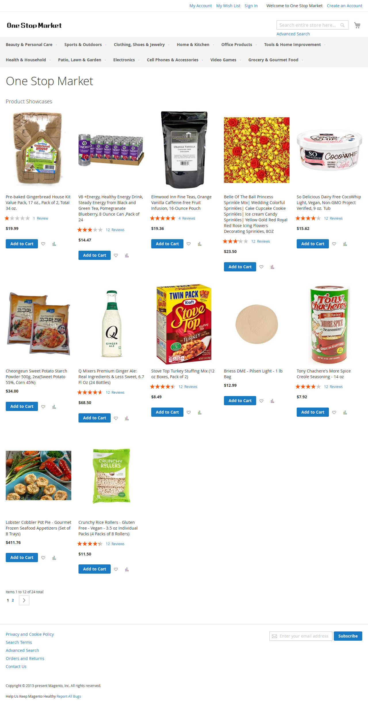

# Project 79 (P79): Cost-Aware Routing for Web Usage Agents

## Executive Summary
A reproducible research codebase for cost-aware routing in web usage agents, built on VisualWebArena (VWA) and optimized for WSL2 plus consumer GPUs such as RTX 4060 8GB. The current focus is a working vertical slice web agent loop (observe → infer → act → env.step) with local Qwen3-VL-4B in 4-bit quantization, plus logging and evaluation hooks to scale into batch experiments.

Repo: https://github.com/Quarkgluonmixture/Cost-Aware-Routing-for-Web-Usage-Agents

## Current Status
- [x] Environment
- [x] Agent

## Screenshot
The following screenshot is captured from the locally hosted Shopping site during a live run.



## 1) What this project is about
Web agents are expensive because they operate over long horizons and large contexts (DOM or AXTree plus screenshots). This project studies routing decisions that reduce cost, latency, and energy proxies while maintaining task success.

We target web-specific routing:
- Representation routing: when to rely on cheap text (AXTree or DOM) versus expensive screenshots and VLM inference.
- Module routing: use small local modules (extractors or rerankers) to compress context before invoking a stronger reasoner.
- Overhead-aware evaluation: report Net Saving = savings minus router overhead.

## 2) Repository structure
```
p79/
  agents/            # Qwen3-VL agent wrapper + strict JSON actions
  envs/              # VWAWrapper (VisualWebArena integration)
  logging/           # JSONL step logger + episode summary
  policies/          # router baselines (placeholder → implement)
  utils/             # parsing, validation, metrics helpers
configs/
  default.yaml       # model/env/logging defaults
scripts/
  vwa_env.sh         # env vars for local VWA sites
  run_one_vwa_episode.py
  run_vwa_batch.py
  summarize_results.py
external/
  visualwebarena/    # VWA repo (installed editable)
```

## 3) Environment setup (WSL2 + Conda)
### 3.1 Create environment
```bash
conda create -n p79_ai python=3.10 -y
conda activate p79_ai
```

### 3.2 Install this repo
```bash
pip install -e .
```

### 3.3 Recommended cache paths (external SSD)
```bash
export HF_HOME="/mnt/d/(Gluons)/hf_cache"
export TRANSFORMERS_CACHE="$HF_HOME/transformers"
export HF_HUB_CACHE="$HF_HOME/hub"
```

## 4) Model weights (Qwen3-VL-4B)
Local weights path:
```
/mnt/d/(Gluons)/hf_models/Qwen3-VL-4B-Instruct
```

Set in configs/default.yaml:
```yaml
model:
  path: "/mnt/d/(Gluons)/hf_models/Qwen3-VL-4B-Instruct"
  quantization: "4bit"
  device: "cuda"
```

Quick sanity check:
```bash
python - <<'PY'
from transformers import AutoConfig
path="/mnt/d/(Gluons)/hf_models/Qwen3-VL-4B-Instruct"
cfg=AutoConfig.from_pretrained(path, trust_remote_code=True)
print("OK:", cfg.model_type, cfg.architectures)
PY
```

## 5) VisualWebArena setup
### 5.1 Start local VWA sites (Docker)
Follow VWA instructions to start the containers (Shopping, Reddit, Wikipedia, Classifieds, Homepage). Once running, endpoints look like:
```
http://localhost:7770  # shopping
http://localhost:9999  # classifieds
```

### 5.2 Set environment variables
```bash
source scripts/vwa_env.sh
```

### 5.3 Auth states (.auth)
```bash
cp -r external/visualwebarena/.auth .
```

## 6) Run a single VWA episode (Cookbook loop)
```bash
conda activate p79_ai
source scripts/vwa_env.sh
export CC=$(which x86_64-conda-linux-gnu-gcc)

python scripts/run_one_vwa_episode.py \
  --task_config external/visualwebarena/config_files/vwa/test_shopping.raw.json \
  --task_id 0 \
  --headless
```

Outputs:
- episode_0.jsonl (step-level logs)
- step screenshots under visualization/ (if enabled)

## 7) Logging and metrics
Each episode produces JSONL lines containing:
- step index, instruction, AXTree text
- screenshot, action, raw_action (if enabled)
- reward, done, latency_ms, tokens

Planned research metrics:
- success rate
- P95 latency
- token or cost proxy
- Net Saving (baseline cost minus routed cost minus routing overhead)
- optional energy proxy

## 8) Batch experiments (next step)
Planned interface:
```bash
python scripts/run_batch.py \
  --suite test_shopping \
  --max_tasks 50 \
  --policy baseline_strong \
  --out_dir logs/exp1
```

Policies to implement in p79/policies:
- always_small
- always_strong
- threshold_router
- cascade_router
- module_router

## 9) Troubleshooting
### A) VWA install downgrades transformers
```bash
pip install -e external/visualwebarena --no-deps
```

### B) WSL triton or bitsandbytes compile errors
```bash
export CC=$(which x86_64-conda-linux-gnu-gcc)
```

### C) Auth or site variables missing
```bash
source scripts/vwa_env.sh
ls .auth
```

## 10) Citation and related work
This project builds on cost-aware routing methods (FrugalGPT, RouteLLM, AutoMix) and web agent benchmarks (WebArena, VisualWebArena).
