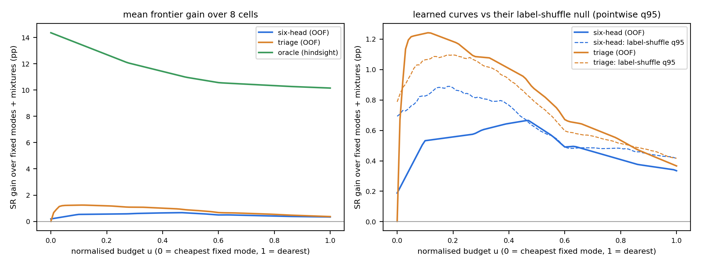
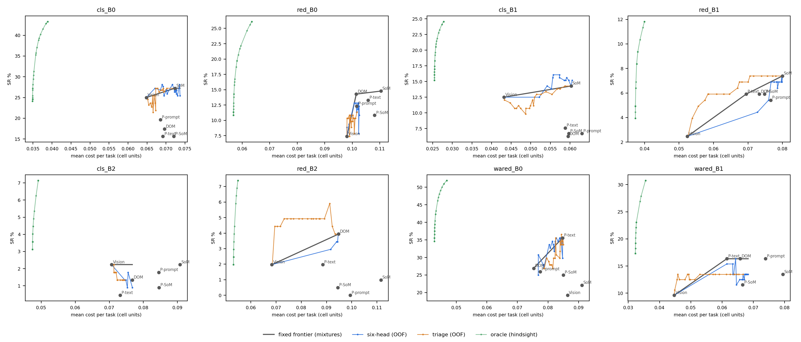

# Representation routing on the SR–cost plane — the frontier, not a dominance verdict

Generated by `scripts/analysis/representation_routing_frontier.py`. `post_hoc_exploratory=True`, `h10_eligible=False`. Chronicle: 实验笔记 §539.

Answers VLM4RWD AC xab8 / 1MR9 #2: does a learned representation router reach (cost, SR) points that no fixed policy — **including random mixtures of fixed modes** — reaches? The fixed frontier is the upper concave envelope of the six fixed modes (in-sample, so the fixed side picks its modes knowing the outcomes). Learned curves are out-of-fold (task-held-out 5-fold, seed 42, matched 18 features, modes and decision costs re-selected on training rows). Excess = SR of a curve point minus the frontier's SR at the same mean cost; a point cheaper than every fixed mode is scored against the cheapest mode's SR.

Cost is `total_billed_cost_usd` per task, **comparable within a cell only**.

`p` = label-shuffle null for the curve's **max** excess (task bundle permuted against X, whole curve refitted per draw, B=1000, plus-one estimator), so the selection over the sweep is inside the null. Holm across the 8 cells, per curve.

## 1. Headline: how far above the fixed frontier does each curve get?

| cell | n | fixed frontier (modes on hull) | oracle max excess | six-head max excess (τ) | p | Holm | triage max excess (q) | p | Holm |
|---|---|---|---|---|---|---|---|---|---|
| cls_B0 | 224 | Vision → SoM | +18.30pp | +1.89pp (0.4) | 0.0839 | — | +1.49pp (0.25) | 0.2687 | — |
| red_B0 | 203 | Vision → DOM → SoM | +18.72pp | +1.48pp (0.05) | 0.1958 | — | +2.89pp (0.3) | 0.0949 | — |
| cls_B1 | 224 | Vision → SoM | +12.05pp | +2.26pp (0.2) | 0.0160 | — | +0.16pp (0.05) | 0.7782 | — |
| red_B1 | 203 | Vision → P-text → SoM | +9.36pp | +0.03pp (0.6) | 0.5694 | — | +2.24pp (0.8) | 0.0110 | — |
| cls_B2 | 224 | Vision | +4.91pp | +0.00pp (0.0) | 0.9850 | — | +0.00pp (all) | 0.9870 | — |
| red_B2 | 203 | Vision → DOM | +5.42pp | +0.01pp (0.25) | 0.7153 | — | +2.59pp (0.8) | 0.0030 | pass |
| wared_B0 | 104 | DOM → P-text | +25.00pp | +2.44pp (0.15) | 0.3636 | — | +2.08pp (0.15) | 0.4186 | — |
| wared_B1 | 104 | Vision → P-text | +21.15pp | +0.00pp (0.0) | 1.0000 | — | +3.38pp (0.9) | 0.0020 | pass |

- Six-head curve rises above the fixed frontier anywhere in **6 of 8** cells; the max excess survives its null under Holm in **0 of 8**.
- Triage curve: above the frontier in **7 of 8**; Holm survivors **2 of 8**.
- Share of the oracle's headroom the six-head max excess captures, per cell: cls_B0 10%, red_B0 8%, cls_B1 19%, red_B1 0%, cls_B2 0%, red_B2 0%, wared_B0 10%, wared_B1 0%.

A positive max excess is a point estimate on one run per arm; read it against the null column, and — where a cell has one — against its rerun band (which band definition to use is the open §530.4 #2 decision, so no band is applied here).

## 2. Pooled across cells: the frontier on a normalised budget

Cost units differ between cells, so each cell's budget is normalised: **u = 0 is its cheapest fixed mode, u = 1 its dearest** (101 grid points). Per cell and u, the **frontier gain** is the SR the attainable envelope gains when the curve's operating points are added to the fixed modes (and may be mixed with them) — ≥ 0 by construction. The pooled curve is the equal-weight mean over the 8 cells. Its max over u is tested against the same B=1000 label-shuffle draws, averaged across cells draw by draw before taking the max, so the choice of u is inside the null. A cell's max gain is not §1's max excess: it can be higher (the curve's own points may be mixed) or slightly lower (it is read on the grid inside [0, 1], so a peak between grid points or outside the fixed cost range is missed). The per-cell tests stay those of §1.

| curve | pooled max gain | at u | cells with any gain | null max: median / q95 | p | share of oracle max |
|---|---|---|---|---|---|---|
| six-head (OOF) | +0.67pp | 0.47 | 6 of 8 | 0.46 / 1.00pp | 0.2517 | 5% |
| triage (OOF) | +1.24pp | 0.11 | 7 of 8 | 0.62 / 1.20pp | 0.0430 | 9% |
| oracle (hindsight) | +14.36pp | 0.0 | 8 of 8 | — | — | — |

Per cell (gain is the max over u of that cell's curve, in SR pp):

| cell | u = 0 → 1 cost | six-head max gain (u) | triage max gain (u) | oracle max gain (u) |
|---|---|---|---|---|
| cls_B0 | 0.06481 → 0.07236 | +1.88pp (0.55) | +1.49pp (0.33) | +18.30pp (0.0) |
| red_B0 | 0.09807 → 0.11045 | +1.51pp (0.0) | +2.81pp (0.01) | +18.72pp (0.0) |
| cls_B1 | 0.04316 → 0.06304 | +2.24pp (0.64) | +0.16pp (0.78) | +12.05pp (0.0) |
| red_B1 | 0.05240 → 0.08000 | +0.03pp (0.99) | +2.23pp (0.22) | +9.36pp (0.0) |
| cls_B2 | 0.07065 → 0.09075 | +0.00pp (0.0) | +0.00pp (0.0) | +4.91pp (0.0) |
| red_B2 | 0.06833 → 0.11160 | +0.01pp (0.6) | +2.58pp (0.12) | +5.42pp (0.0) |
| wared_B0 | 0.07531 → 0.09110 | +2.43pp (0.1) | +2.06pp (0.45) | +25.00pp (0.0) |
| wared_B1 | 0.04468 → 0.07944 | +0.00pp (0.0) | +3.33pp (0.04) | +21.15pp (0.0) |

Pooled gain at selected budgets (pp; null = pointwise q95 of the pooled draws, not a test):

| u | six-head | null q95 | triage | null q95 | oracle |
|---|---|---|---|---|---|
| 0.0 | 0.19 | 0.69 | 0.00 | 0.79 | 14.36 |
| 0.1 | 0.53 | 0.83 | 1.24 | 1.06 | 13.53 |
| 0.25 | 0.57 | 0.84 | 1.12 | 1.07 | 12.29 |
| 0.5 | 0.63 | 0.61 | 0.86 | 0.78 | 10.92 |
| 0.75 | 0.43 | 0.48 | 0.58 | 0.54 | 10.39 |
| 1.0 | 0.33 | 0.42 | 0.37 | 0.42 | 10.15 |

## 3. Per cell: the curves

Fixed modes and frontier, then each learned curve's points that sit on or above the frontier (all points are in the JSON).

### cls_B0 (n=224, solvable 43.3%)

| fixed mode | mean cost | SR % | on frontier |
|---|---|---|---|
| Vision | 0.06481 | 25.00 | yes |
| P-prompt | 0.06853 | 19.64 |  |
| P-text | 0.06919 | 15.62 |  |
| DOM | 0.06962 | 17.41 |  |
| P-SoM | 0.07206 | 15.62 |  |
| SoM | 0.07236 | 27.23 | yes |

six-head points on/above the frontier: tau=0.0 → 25.00% @ 0.06481 (+0.00pp), tau=0.05 → 27.23% @ 0.06710 (+1.55pp), tau=0.2 → 26.79% @ 0.07015 (+0.21pp), tau=0.25 → 27.68% @ 0.06922 (+1.37pp), tau=0.35 → 26.79% @ 0.06852 (+0.69pp), tau=0.4 → 28.12% @ 0.06900 (+1.89pp), tau=0.45 → 28.12% @ 0.07168 (+1.09pp), tau=0.5 → 28.12% @ 0.07356 (+0.89pp), tau=1.0 → 27.23% @ 0.07236 (+0.00pp)

triage points on/above the frontier: quantile=0.0 → 27.23% @ 0.07236 (+0.00pp), quantile=0.05 → 27.23% @ 0.07024 (+0.63pp), quantile=0.1 → 26.79% @ 0.06911 (+0.51pp), quantile=0.15 → 27.23% @ 0.06929 (+0.91pp), quantile=0.2 → 27.23% @ 0.06780 (+1.35pp), quantile=0.25 → 27.23% @ 0.06730 (+1.49pp), quantile=0.3 → 26.79% @ 0.06871 (+0.63pp), quantile=0.4 → 26.34% @ 0.06819 (+0.34pp), quantile=0.95 → 25.00% @ 0.06479 (+0.00pp), quantile=all → 25.00% @ 0.06481 (+0.00pp)

### red_B0 (n=203, solvable 26.1%)

| fixed mode | mean cost | SR % | on frontier |
|---|---|---|---|
| Vision | 0.09807 | 7.39 | yes |
| DOM | 0.10147 | 14.29 | yes |
| P-prompt | 0.10163 | 12.32 |  |
| P-text | 0.10577 | 13.30 |  |
| P-SoM | 0.10814 | 10.84 |  |
| SoM | 0.11045 | 14.78 | yes |

six-head points on/above the frontier: tau=0.0 → 7.39% @ 0.09807 (+0.00pp), tau=0.05 → 8.87% @ 0.09805 (+1.48pp), tau=0.15 → 9.36% @ 0.09884 (+0.42pp)

triage points on/above the frontier: quantile=0.2 → 9.85% @ 0.09924 (+0.10pp), quantile=0.3 → 10.34% @ 0.09810 (+2.89pp), quantile=0.35 → 10.34% @ 0.09928 (+0.49pp), quantile=0.5 → 10.84% @ 0.09896 (+1.64pp), quantile=0.55 → 10.34% @ 0.09837 (+2.34pp), quantile=0.6 → 10.34% @ 0.09923 (+0.60pp), quantile=0.65 → 10.84% @ 0.09933 (+0.89pp), quantile=0.75 → 10.34% @ 0.09919 (+0.67pp), quantile=0.8 → 10.34% @ 0.09952 (+0.01pp), quantile=0.85 → 10.34% @ 0.09847 (+2.14pp), quantile=all → 7.39% @ 0.09807 (+0.00pp)

### cls_B1 (n=224, solvable 24.6%)

| fixed mode | mean cost | SR % | on frontier |
|---|---|---|---|
| Vision | 0.04316 | 12.50 | yes |
| P-text | 0.05879 | 7.59 |  |
| DOM | 0.05951 | 6.25 |  |
| P-SoM | 0.05970 | 6.70 |  |
| SoM | 0.06028 | 14.29 | yes |
| P-prompt | 0.06304 | 6.70 |  |

six-head points on/above the frontier: tau=0.0 → 12.50% @ 0.04316 (+0.00pp), tau=0.1 → 14.29% @ 0.05416 (+0.64pp), tau=0.15 → 13.84% @ 0.05527 (+0.08pp), tau=0.2 → 16.07% @ 0.05576 (+2.26pp), tau=0.25 → 15.62% @ 0.05560 (+1.83pp), tau=0.3 → 16.07% @ 0.05731 (+2.09pp), tau=0.35 → 15.62% @ 0.05733 (+1.65pp), tau=0.4 → 15.18% @ 0.05853 (+1.07pp), tau=0.45 → 15.62% @ 0.05915 (+1.46pp), tau=0.5 → 15.18% @ 0.05887 (+1.04pp), tau=0.55 → 15.18% @ 0.05966 (+0.96pp), tau=0.6 → 15.18% @ 0.06051 (+0.89pp), tau=0.65 → 14.29% @ 0.06028 (+0.00pp), tau=0.7 → 14.29% @ 0.06028 (+0.00pp), tau=0.75 → 14.29% @ 0.06028 (+0.00pp), tau=0.8 → 14.29% @ 0.06028 (+0.00pp), tau=0.85 → 14.29% @ 0.06028 (+0.00pp), tau=0.9 → 14.29% @ 0.06028 (+0.00pp), tau=0.95 → 14.29% @ 0.06028 (+0.00pp), tau=1.0 → 14.29% @ 0.06028 (+0.00pp)

triage points on/above the frontier: quantile=0.0 → 14.29% @ 0.06028 (+0.00pp), quantile=0.05 → 14.29% @ 0.05874 (+0.16pp), quantile=all → 12.50% @ 0.04316 (+0.00pp)

### red_B1 (n=203, solvable 11.8%)

| fixed mode | mean cost | SR % | on frontier |
|---|---|---|---|
| Vision | 0.05240 | 2.46 | yes |
| P-text | 0.06948 | 5.91 | yes |
| DOM | 0.07330 | 5.91 |  |
| P-SoM | 0.07480 | 5.91 |  |
| P-prompt | 0.07656 | 5.42 |  |
| SoM | 0.08000 | 7.39 | yes |

six-head points on/above the frontier: tau=0.0 → 2.46% @ 0.05240 (+0.00pp), tau=0.55 → 7.39% @ 0.08012 (+0.00pp), tau=0.6 → 7.39% @ 0.07978 (+0.03pp), tau=0.65 → 7.39% @ 0.08000 (+0.00pp), tau=0.7 → 7.39% @ 0.08000 (+0.00pp), tau=0.75 → 7.39% @ 0.08000 (+0.00pp), tau=0.8 → 7.39% @ 0.08000 (+0.00pp), tau=0.85 → 7.39% @ 0.08000 (+0.00pp), tau=0.9 → 7.39% @ 0.08000 (+0.00pp), tau=0.95 → 7.39% @ 0.08000 (+0.00pp), tau=1.0 → 7.39% @ 0.08000 (+0.00pp)

triage points on/above the frontier: quantile=0.0 → 7.39% @ 0.08000 (+0.00pp), quantile=0.05 → 7.39% @ 0.07963 (+0.05pp), quantile=0.1 → 7.39% @ 0.07807 (+0.27pp), quantile=0.15 → 7.39% @ 0.07714 (+0.40pp), quantile=0.2 → 7.39% @ 0.07561 (+0.62pp), quantile=0.25 → 7.39% @ 0.07391 (+0.86pp), quantile=0.3 → 7.39% @ 0.07160 (+1.18pp), quantile=0.35 → 7.39% @ 0.07057 (+1.32pp), quantile=0.4 → 6.90% @ 0.07003 (+0.91pp), quantile=0.45 → 6.90% @ 0.06821 (+1.24pp), quantile=0.5 → 6.90% @ 0.06751 (+1.38pp), quantile=0.55 → 6.40% @ 0.06695 (+1.00pp), quantile=0.6 → 5.91% @ 0.06462 (+0.98pp), quantile=0.65 → 5.91% @ 0.06294 (+1.32pp), quantile=0.7 → 5.91% @ 0.06087 (+1.74pp), quantile=0.75 → 5.91% @ 0.05855 (+2.21pp), quantile=0.8 → 5.91% @ 0.05838 (+2.24pp), quantile=0.85 → 5.42% @ 0.05749 (+1.93pp), quantile=0.9 → 4.93% @ 0.05559 (+1.82pp), quantile=0.95 → 3.94% @ 0.05381 (+1.19pp), quantile=all → 2.46% @ 0.05240 (+0.00pp)

### cls_B2 (n=224, solvable 7.1%)

| fixed mode | mean cost | SR % | on frontier |
|---|---|---|---|
| Vision | 0.07065 | 2.23 | yes |
| P-text | 0.07320 | 0.45 |  |
| DOM | 0.07676 | 1.34 |  |
| P-prompt | 0.08453 | 1.79 |  |
| P-SoM | 0.08456 | 0.89 |  |
| SoM | 0.09075 | 2.23 |  |

six-head points on/above the frontier: tau=0.0 → 2.23% @ 0.07065 (+0.00pp)

triage points on/above the frontier: quantile=0.95 → 2.23% @ 0.07133 (+0.00pp), quantile=1.0 → 2.23% @ 0.07107 (+0.00pp), quantile=all → 2.23% @ 0.07065 (+0.00pp)

### red_B2 (n=203, solvable 7.4%)

| fixed mode | mean cost | SR % | on frontier |
|---|---|---|---|
| Vision | 0.06833 | 1.97 | yes |
| P-text | 0.08852 | 1.97 |  |
| P-SoM | 0.09451 | 0.49 |  |
| DOM | 0.09479 | 3.94 | yes |
| P-prompt | 0.09940 | 0.00 |  |
| SoM | 0.11160 | 0.99 |  |

six-head points on/above the frontier: tau=0.0 → 1.97% @ 0.06833 (+0.00pp), tau=0.25 → 3.94% @ 0.09467 (+0.01pp), tau=0.3 → 3.94% @ 0.09479 (+0.00pp), tau=0.35 → 3.94% @ 0.09479 (+0.00pp), tau=0.4 → 3.94% @ 0.09479 (+0.00pp), tau=0.45 → 3.94% @ 0.09479 (+0.00pp), tau=0.5 → 3.94% @ 0.09479 (+0.00pp), tau=0.55 → 3.94% @ 0.09479 (+0.00pp), tau=0.6 → 3.94% @ 0.09479 (+0.00pp), tau=0.65 → 3.94% @ 0.09479 (+0.00pp), tau=0.7 → 3.94% @ 0.09479 (+0.00pp), tau=0.75 → 3.94% @ 0.09479 (+0.00pp), tau=0.8 → 3.94% @ 0.09479 (+0.00pp), tau=0.85 → 3.94% @ 0.09479 (+0.00pp), tau=0.9 → 3.94% @ 0.09479 (+0.00pp), tau=0.95 → 3.94% @ 0.09479 (+0.00pp), tau=1.0 → 3.94% @ 0.09479 (+0.00pp)

triage points on/above the frontier: quantile=0.0 → 3.94% @ 0.09479 (+0.00pp), quantile=0.05 → 3.94% @ 0.09342 (+0.10pp), quantile=0.1 → 4.43% @ 0.09228 (+0.68pp), quantile=0.15 → 5.91% @ 0.09129 (+2.23pp), quantile=0.2 → 4.93% @ 0.08917 (+1.40pp), quantile=0.25 → 4.93% @ 0.08739 (+1.54pp), quantile=0.3 → 4.93% @ 0.08714 (+1.56pp), quantile=0.35 → 4.93% @ 0.08585 (+1.65pp), quantile=0.4 → 4.93% @ 0.08475 (+1.73pp), quantile=0.45 → 4.93% @ 0.08404 (+1.79pp), quantile=0.5 → 4.93% @ 0.08250 (+1.90pp), quantile=0.55 → 4.93% @ 0.08039 (+2.06pp), quantile=0.6 → 4.93% @ 0.07906 (+2.16pp), quantile=0.65 → 4.93% @ 0.07695 (+2.31pp), quantile=0.7 → 4.93% @ 0.07586 (+2.40pp), quantile=0.75 → 4.93% @ 0.07433 (+2.51pp), quantile=0.8 → 4.93% @ 0.07324 (+2.59pp), quantile=0.85 → 4.43% @ 0.07168 (+2.21pp), quantile=0.9 → 4.43% @ 0.07048 (+2.30pp), quantile=0.95 → 4.43% @ 0.06950 (+2.38pp), quantile=all → 1.97% @ 0.06833 (+0.00pp)

### wared_B0 (n=104, solvable 51.9%)

| fixed mode | mean cost | SR % | on frontier |
|---|---|---|---|
| DOM | 0.07531 | 26.92 | yes |
| P-prompt | 0.07747 | 25.96 |  |
| P-text | 0.08478 | 35.58 | yes |
| P-SoM | 0.08498 | 25.00 |  |
| Vision | 0.08640 | 19.23 |  |
| SoM | 0.09110 | 22.12 |  |

six-head points on/above the frontier: tau=0.15 → 30.77% @ 0.07685 (+2.44pp), tau=0.35 → 32.69% @ 0.08073 (+0.81pp), tau=0.4 → 33.65% @ 0.08039 (+2.09pp), tau=0.45 → 33.65% @ 0.08171 (+0.88pp), tau=0.5 → 34.62% @ 0.08144 (+2.09pp), tau=0.55 → 35.58% @ 0.08271 (+1.89pp), tau=0.6 → 34.62% @ 0.08238 (+1.23pp), tau=0.7 → 35.58% @ 0.08382 (+0.88pp), tau=0.8 → 35.58% @ 0.08391 (+0.80pp), tau=0.85 → 34.62% @ 0.08330 (+0.39pp), tau=0.95 → 35.58% @ 0.08417 (+0.56pp), tau=1.0 → 35.58% @ 0.08478 (+0.00pp)

triage points on/above the frontier: quantile=0.0 → 35.58% @ 0.08478 (+0.00pp), quantile=0.05 → 35.58% @ 0.08489 (+0.00pp), quantile=0.1 → 36.54% @ 0.08437 (+1.33pp), quantile=0.15 → 35.58% @ 0.08250 (+2.08pp)

### wared_B1 (n=104, solvable 30.8%)

| fixed mode | mean cost | SR % | on frontier |
|---|---|---|---|
| Vision | 0.04468 | 9.62 | yes |
| P-text | 0.06151 | 16.35 | yes |
| DOM | 0.06579 | 16.35 |  |
| P-SoM | 0.06659 | 11.54 |  |
| P-prompt | 0.07386 | 16.35 |  |
| SoM | 0.07944 | 13.46 |  |

six-head points on/above the frontier: tau=0.0 → 9.62% @ 0.04468 (+0.00pp), tau=0.1 → 16.35% @ 0.06433 (+0.00pp)

triage points on/above the frontier: quantile=0.5 → 13.46% @ 0.05288 (+0.57pp), quantile=0.55 → 12.50% @ 0.05124 (+0.26pp), quantile=0.6 → 12.50% @ 0.04982 (+0.83pp), quantile=0.65 → 12.50% @ 0.04957 (+0.93pp), quantile=0.7 → 13.46% @ 0.04930 (+2.00pp), quantile=0.75 → 13.46% @ 0.04898 (+2.13pp), quantile=0.8 → 12.50% @ 0.04811 (+1.51pp), quantile=0.85 → 12.50% @ 0.04561 (+2.51pp), quantile=0.9 → 13.46% @ 0.04584 (+3.38pp), quantile=0.95 → 12.50% @ 0.04636 (+2.21pp), quantile=1.0 → 10.58% @ 0.04486 (+0.89pp), quantile=all → 9.62% @ 0.04468 (+0.00pp)
