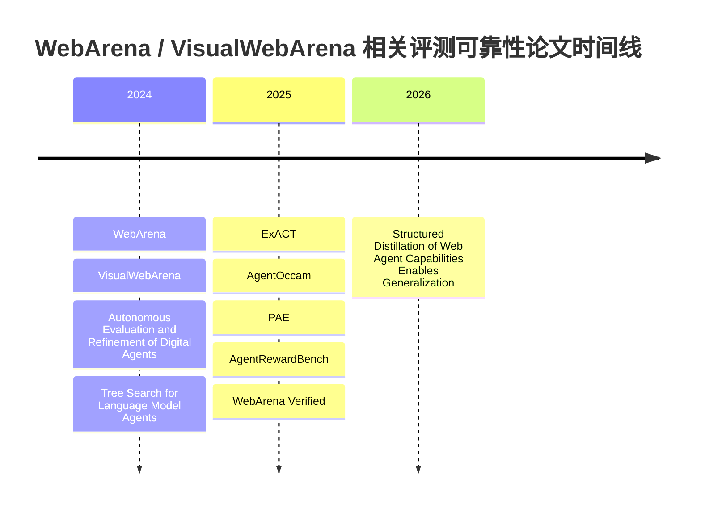

# WebArena与VisualWebArena论文中的评测可靠性研究报告

## 执行摘要

在我筛出的 **10 篇最相关核心论文** 里，一个很清楚的结论是：**大多数使用 WebArena / VisualWebArena 的模型论文，默认继承官方 evaluator，并直接报告原始成功率；真正把“评测器噪声、假阳性、字符串匹配偏差、URL/DOM 检查脆弱性”当成研究对象认真处理的论文，其实很少。** 最早的两篇基准论文更多是在“定义 evaluator”；后续很多方法论文是在“利用 evaluator 报成绩”，而不是“审计 evaluator 本身”。真正对 benchmark scoring 做系统修补的，核心是 **AgentOccam**、**PAE** 和 **WebArena Verified**；其中 **WebArena Verified** 是目前最彻底、最方法论化的修复方案。citeturn20view0turn23view0turn30view0turn34view0turn39view1

如果把你最关心的五个维度压缩成一句话：**D1 string_match/fuzzy_match 噪声** 上，原始 WebArena 只做了小规模 spot-check，VisualWebArena 基本沿用而未深究；**D2“没真正完成但被判对”** 上，PAE 和 WebArena Verified 都明确承认并处理了这类问题；**D3 视觉任务公平性** 上，VisualWebArena 自身把所有任务定义为视觉落地任务，而 ExACT 在微调比较时显式把 VWA 限制到 text-only modality；**D4 program_html / url_match 局限** 上，AgentOccam 与 WebArena Verified 的讨论最具体；**D5 原始 vs 调整后成功率** 上，AgentOccam、PAE、WebArena Verified 三篇最明确地同时给出原始或近原始设定与修正后设定。citeturn18view3turn23view0turn30view0turn34view0turn36view3turn37view0turn39view1

还要特别说明一点：你举的“例如 entity["organization","OpenAI","ai research lab"] 的 GPT-4o-mini fuzzy matching 假阳性”这个现象，在我这批**直接使用 WebArena / VisualWebArena 的核心论文**里，**没有哪篇用这个表述作过正式 benchmark-level 审计**。更常见的做法是：原始基准使用 GPT-4-0613 或 GPT-4-Turbo 做 fuzzy_match；后续修复论文干脆改掉这条路径，而不是继续依赖更小的 judge 模型。也就是说，**核心问题已经被承认，但 GPT-4o-mini 这个具体实例在该核心语料中基本是“未明确写出”**。citeturn18view3turn23view0turn39view1

## 范围与判断标准

本报告优先收录了 **直接把 WebArena 或 VisualWebArena 作为评测基准，并且在正文或附录里对 scoring / evaluation 给出可核实文字证据** 的论文，共 10 篇。很多只是在表格里报 WebArena 分数、却不讨论 evaluator 的方法论文没有纳入核心逐篇条目，因为在你的五个维度上它们通常只能得到一连串“未说明”。下文中，凡是论文没有明确写到的维度，我都标成 **“未说明”**；凡是只做了局部的、间接的、内部 value function 层面的控制，我标成 **“部分”**。页码统一用 **PDF 索引页**（例如 `P16`），以便和摘录对应。citeturn20view0turn23view0turn39view0turn39view1

从谱系上看，WebArena 先定义了 `exact_match / must_include / fuzzy_match + programmatic state checks` 的基本范式；VisualWebArena 在此基础上再加入 `eval_vqa`、`eval_fuzzy_image_match` 和 locator+URL 的视觉评测；再往后，AgentRewardBench 开始把 WA/VWA 的 evaluator 类型拆开做诊断，WebArena Verified 则把“字符串匹配、DOM/page-content 检查、含糊任务定义、泛化 `N/A`、未真实交互却得分”这些问题系统化解决。citeturn20view0turn23view0turn40view2turn39view1

image_group{"layout":"carousel","aspect_ratio":"16:9","query":["WebArena benchmark paper evaluation figure", "VisualWebArena benchmark figure visually grounded tasks", "WebArena Verified benchmark figure evaluation reliability", "AgentRewardBench web agent evaluation figure"],"num_per_query":1}

## 总览对照表

下面这张表只保留对你的五个维度最相关的信息。  
标记说明：**已处理** = 论文明确给出修复或过滤；**部分** = 有局部控制或间接讨论；**未说明** = 原文没有明确讨论。各行证据与页码在下一节逐篇展开。citeturn20view0turn23view0turn26view0turn30view0turn34view0turn39view0turn39view1turn39view3

| 论文 | 年份 / venue | 基准 | D1 string_match / fuzzy 噪声 | D2 未主动完成却得分 | D3 视觉任务公平性 | D4 program_html / url_match 局限 | D5 原始 vs 调整后 SR | 是否报告假阳性缓解 |
|---|---:|---|---|---|---|---|---|---|
| WebArena citeturn20view0turn18view3 | 2024 / ICLR | WA | 部分：只做 GPT-4 抽查 | 未说明 | 未说明 | 未说明 | 仅原始 | 否 |
| VisualWebArena citeturn23view0turn24view3 | 2024 / ACL | VWA | 未说明 | 未说明 | 已处理：全部任务视觉化，并直接比较 text-only vs VLM | 未说明 | 仅原始 | 否 |
| Autonomous Evaluation and Refinement of Digital Agents citeturn26view0 | 2024 / COLM 版本系 | WA | 未说明 | 部分：强调 FN 比 FP 更伤 | 未说明 | 未说明 | 仅原始 / evaluator-guided | 否 |
| AgentOccam citeturn30view0turn29view1turn29view2 | 2025 / ICLR | WA | 已处理 | 部分 | 未说明 | 已处理 | 原始 + 修正 | 是 |
| Tree Search for Language Model Agents citeturn35view0turn36view3 | 2024 / TMLR-arXiv 系 | WA + VWA | 未说明 | 部分：内部 value prompt 严判 | 未说明（沿用官方设定） | 未说明 | 仅原始 | 否 |
| ExACT citeturn37view0turn38view3 | 2025 / ICLR | VWA | 未说明 | 未说明 | 已处理：VWA text-only modality 子集比较 | 未说明 | 子集 / 模态调整 | 否 |
| PAE citeturn34view0 | 2025 / ICML | WA（重写子集） | 部分：发现 evaluator 假阳性 | 已处理：重写任务集 | 未说明 | 未说明 | 原始 + 重写任务集 | 是 |
| AgentRewardBench citeturn40view2turn40view3turn40view1 | 2025 / COLM | WA + VWA（子样本） | 部分：分 evaluator type 诊断 | 未说明 | 未说明 | 部分：显式拆分 HTML / URL / image query | 人评对照，不是官方 leaderboard SR | 否（诊断型） |
| WebArena Verified citeturn39view1turn40view4turn40view5 | 2025 / openreview 预印本 | WA | 已处理 | 已处理 | 未说明 | 已处理 | 原始 + Verified | 是 |
| Structured Distillation of Web Agent Capabilities Enables Generalization citeturn40view9turn40view10turn40view11 | 2026 / arXiv | WA | 未说明 | 部分：上游 judge 过滤 + exact termination | 未说明 | 未说明 | 未说明 | 是（但属训练数据过滤层） |

**最明确报告“评测假阳性缓解”的论文**：**AgentOccam、PAE、WebArena Verified**；**Structured Distillation** 也处理了 judge false positives，但位置在**训练数据筛选**而不是 benchmark official scoring。citeturn30view0turn34view0turn40view5turn40view9

## 逐篇摘录与评估

**WebArena — Zhou et al., 2024, ICLR 2024，PDF 见文末。**  
方法摘要：该文构建了 812 个自托管网页任务，并把信息检索任务分成 `exact_match`、`must_include`、`fuzzy_match`，把导航/改写任务交给程序化状态检查。摘录：“**39 of them are identical to our human judgment**” （PDF P16）。citeturn20view0turn18view3  
- **D1 / D4**：原始论文明确把 `fuzzy_match` 建在 GPT-4-0613 上，并做了 40 个样本的人审 spot-check；但它并没有系统审计 string-based evaluator 的假阳性，只是在原始构造阶段表达了对 fuzzy evaluator 的信心。citeturn20view0turn18view3
- **D2 / D5**：它设计了不可达任务与 `N/A` 响应，也给 baseline prompt 加了“无法完成时停止”的提示，但没有单独过滤“没有真实完成动作却被 evaluator 判对”的样本；报告的是原始 benchmark success rate。citeturn20view0turn18view3
- **D3**：未说明。该文不是视觉 benchmark，也不讨论 text-only vs multimodal 的公平比较。citeturn20view0

**VisualWebArena — Koh et al., 2024, ACL 2024，PDF 见文末。**  
方法摘要：VisualWebArena 在 WebArena 的 functional evaluation 范式上增加了 `eval_vqa`、`eval_fuzzy_image_match` 以及 locator + URL 的视觉检查原语，用 910 个任务把网页视觉理解拉进 benchmark 主体。摘录：“**All tasks we introduce are visually grounded**” （PDF P0）。citeturn23view0turn24view3  
- **D1 / D4**：它沿用 WebArena 的 `exact_match / must_include / fuzzy_match`，并增加视觉评测函数；但没有单独审计 fuzzy_match 的噪声，也没有讨论 locator+URL 组合会带来的误判边界。citeturn23view0turn24view3
- **D2 / D3**：D2 未说明；D3 则很清楚——论文把全体任务都定义成“视觉落地”，而且直接比较 text-based LLM agents 与 VLM agents，因此这是**视觉公平性设计最明确**的一篇。citeturn23view0turn24view0turn24view3
- **D5**：报告的是原始成功率，没有“修正版 VWA success rate”。citeturn24view1turn23view0

**Autonomous Evaluation and Refinement of Digital Agents — Pan et al., 2024，COLM 2024 / arXiv 版本系，PDF 见文末。**  
方法摘要：这篇工作不改 WebArena evaluator，而是训练一个 domain-general evaluator 去近似它，再把该 evaluator 用作 Reflexion / filtered behavior cloning 的反馈信号。摘录：“**false negative evaluations have a more detrimental impact**” （PDF P4–P5）。citeturn26view0  
- **D1 / D4**：它把 WebArena built-in evaluator 当作“oracle”比较对象，但没有拆解 string_match、url_match 或 program-style checker 的细部缺陷。citeturn26view0
- **D2**：没有对“未主动完成却被判对”的 benchmark task 做过滤；不过它明确指出在 inference-time refinement 里，**false negatives 比 false positives 更伤性能**，因为错把成功轨迹判失败会强迫 agent 重试。citeturn26view0
- **D5**：报告的是 baseline SR 与 evaluator-guided SR 的提升，不是 benchmark 修正前/修正后的成功率。citeturn26view0

**AgentOccam — Yang et al., 2025, ICLR 2025，PDF 见文末。**  
方法摘要：主线方法是 observation/action space alignment，但其真正对你这个问题最有价值的部分在附录 E：他们显式审计并修正 WebArena evaluator。摘录：“**we identified and corrected errors in the original evaluators**” （PDF P6–P7）。citeturn30view0  
- **D1**：这是**最早认真修 string/fuzzy 的方法论文之一**。它把若干 `exact_match` 改成 `fuzzy_match` 或 `must_include`，并专门修改 fuzzy prompt，使“额外但不矛盾的信息”算 fully correct；还修掉了把关键词列表拆成 list 导致永远 partial-correct 的 misuse。citeturn29view1turn29view2
- **D2 / D4**：它明确承认某些任务的 evaluator 本身“questionable”，例如“起草但不要提交邮件”这类任务、以及主观判断“最合适 subreddit”的任务；同时也指出 `url_match` 会把同一页面的另一种合法 URL 判错。对 D2，它更多是**承认并局部保留争议**；对 D4，它给了非常具体的 `url_match` 失效案例。citeturn29view0turn29view1
- **D5**：它是少数明确说自己**同时优于 original evaluators 与 corrected evaluators** 的论文，因此可以算“原始 + 修正后”双报告。citeturn30view0turn29view1

**Tree Search for Language Model Agents — Koh et al., 2024，TMLR / arXiv 系，PDF 见文末。**  
方法摘要：该文把 best-first tree search 加到 WA/VWA agent 上，核心主题是 test-time search，而不是 benchmark repair；但其内部 value function 的 prompt 规则对“什么才算完成”说得很严格。摘录：“**If the bot response is not stop … it is considered a failure**” （PDF P21）。citeturn35view0turn36view3  
- **D2**：虽然它**没有声明修正 benchmark official score**，但它的内部 value function 明确要求：信息检索任务必须以 `stop` 给出正确输出；内容修改任务必须真实提交，不能只是写了没发。这会减少 search 过程中的“假完成”状态。citeturn36view3
- **D1 / D4**：对官方 string_match / program_html / url_match 的噪声没有系统分析，基本沿用 benchmark 原设定。citeturn35view0turn36view2
- **D3 / D5**：它在 WA 上用 text-only GPT-4o，在 VWA 上用 GPT-4o + SoM，没有额外做“视觉-only task 剔除”；最终报的是原始 benchmark success rate。citeturn35view0turn36view2

**ExACT — Yu et al., 2025, ICLR 2025，PDF 见文末。**  
方法摘要：ExACT 把 R-MCTS 与 self-learning 用在 VisualWebArena 上，重点是搜索与自学习，不是 benchmark 修复；但在可比性上，它有一个很关键的操作。摘录：“**we evaluate all methods with a text-only modality**” （PDF P6）。citeturn37view0  
- **D3**：这是它最重要的评测处理。因为当时 GPT-4o fine-tuning 不支持图像，作者把 VWA 的 Classifieds 子集转成 **text-only modality** 来比较 search-free fine-tuned 方法与 search-based 方法，这是一种**模态公平性调整**。citeturn37view0
- **D1 / D2 / D4**：论文没有对官方 fuzzy_match、url_match、program_html 做基准级审计；它的“reliable state evaluation”是内部 search 组件，不是 benchmark official scoring 的再定义。citeturn37view0turn38view3
- **D5**：它报告的是**子集 / 模态调整后的结果**，而不是对整个 VWA 官方 success rate 的“修正版”重算。citeturn37view0

**Proposer-Agent-Evaluator — Zhou et al., 2025, ICML 2025，PDF 见文末。**  
方法摘要：PAE 用 proposer-agent-evaluator 的 RL 框架在网页环境中自主提出任务、执行并用 evaluator 给 sparse reward；在 WebArena 上，他们最终不得不改 benchmark 子集。摘录：“**around half of the successful trajectories … are false positives**” （PDF P22）。citeturn34view0  
- **D1 / D2**：这篇是**最直接承认 WebArena evaluator 假阳性**的论文之一。它说在 PostMill 和 OneStopMarket 上，模型很多“成功”其实只是猜了 `"no"` 或 `"N/A"`，恰好撞上不可执行 ground truth，因此被 evaluator 算对。这个现象本质上就是**没有真正完成任务，却获得了正奖励**。citeturn34view0
- **D5**：由于这些假阳性让真实成功率“低于 2%”，作者干脆**重写了任务**并改用 **WebArena Easy** 作为主要实验入口，同时把原始 split 的结果放到附录。这是很少见的“原始 + 调整后任务集”双报告。citeturn34view0
- **D3 / D4**：未说明。该文是 vision-based web agents，但没有做 text-only vs multimodal 公平比较，也没有细拆 program_html / url_match。citeturn32view0turn34view0

**AgentRewardBench — Lù et al., 2025, COLM 2025，PDF 见文末。**  
方法摘要：这篇论文不是提出新 agent，而是提出一个**评测评测器**的 benchmark：用专家标注的 web trajectories 去测 rule-based evaluator 和 LLM judges 的好坏。摘录：“**tends to underreport the success rate**” （PDF P0）。citeturn40view3  
- **D1 / D4**：它显式把 WebArena / VisualWebArena 的 evaluator type 切成 **string matching、HTML-based programs、webpage image querying、final URL matching** 四类做分析，因此对你想看的 evaluator family 非常对口。citeturn40view2
- **D2**：它指出自动评测下，任务可能“更早终止”却拿不到正奖励，也可能成功却不被识别，但它没有把“未主动提交却被判对”专门做成官方过滤规则。它的贡献更偏**诊断**，不是修补 benchmark 本身。citeturn40view1turn40view3
- **D5**：它比较的是**专家真值 vs 自动 evaluator**，不是重新发布 WA/VWA leaderboard 成绩；因此这里更适合看作“评测校准”，而不是“修正版公开 SR”。citeturn40view2turn40view3

**WebArena Verified — 2025，openreview 预印本，PDF 见文末。**  
方法摘要：这是目前最系统的 WebArena 可靠性修复工程：全量审计 812 个任务，把 task spec、reference answer、matching、DOM/page-level checks 和 agent activity verification 一起重做。摘录：“**false positives from misaligned task definitions and brittle string matching**” （PDF P1）。citeturn39view1turn40view4  
- **D1**：这是目前**最强的 string_match 噪声回应**。它用 **type-aware exact matching + semantic normalization** 替换脆弱 substring matching，并直接移除了 118 个依赖 fuzzy matching 的 LLM judge 路径。citeturn40view4turn40view5
- **D2**：它也是目前**最强的“非主动完成却得分”回应**。网络活动监控要求至少访问目标域、显式 status code 区分真正未找到和策略性放弃，并且“generic `N/A` returns” 被禁止。换句话说，它不再接受“坐在起点靠常识答题”这种假成功。citeturn40view5turn41view3
- **D4 / D5**：它直接把 DOM-dependent / page-content evaluator 换成 backend state verification，并提供 before/after 诊断；在我这批论文里，这是对 `program_html / url_match` 类脆弱性的**最直接修复**。同时，它明确指出 VisualWebArena 基本继承了 WebArena 的评测方法而未解决系统可靠性。citeturn39view1turn40view4turn40view5

**Structured Distillation of Web Agent Capabilities Enables Generalization — Lù & Reddy, 2026, arXiv 2026，PDF 见文末。**  
方法摘要：这篇论文用 Agent-as-Annotators 生成并筛选合成轨迹，再训练学生模型；与 benchmark official scoring 的关系不在“修榜单”，而在“修训练数据的判定噪声”。摘录：“**identify 144 additional false positives**” （PDF P27）。citeturn40view9  
- **D1**：它不讨论 WebArena 官方 string_match 的噪声；它讨论的是**Judge 在合成数据筛选阶段的假阳性**。所以这是“上游训练信号”层面的评测可靠性，而不是 benchmark evaluator 本体。citeturn40view9turn40view10
- **D2**：部分有处理。论文要求 exploration 至少 10 步并产出精确 termination string，避免过早终止；同时只有通过 Judge 的成功轨迹才进入训练集。citeturn40view10turn40view11
- **D5**：它报告的是 full pipeline 与 ablation 的性能变化，而不是“原始 benchmark 分数 vs 调整后 benchmark 分数”。因此该维度应标 **未说明**。citeturn39view3turn40view9

## 年份时间线

下面的时间线只放本报告正文逐篇分析的核心论文。可以看到，**2024 年主要是定义 benchmark 与用 benchmark 报分；2025 年开始出现显式的 evaluator 审计、任务重写和 verifier benchmark；到 2026 年，可靠性问题进一步上移到了“训练数据 judge 过滤”层面。** citeturn20view0turn23view0turn26view0turn35view0turn37view0turn30view0turn34view0turn39view0turn39view1turn39view3



## 综合判断

如果只问“**哪几篇最值得你在复现实验时优先参考**”，我的排序会是：**WebArena Verified > AgentOccam > PAE > AgentRewardBench**。原因很简单。WebArena Verified 给的是**完整 benchmark 修复方案**；AgentOccam 给的是**方法论文视角下最细的 evaluator 修补附录**；PAE 给的是**最直观的假阳性实证**——agent 猜 `"no"` / `"N/A"` 就可能被计为成功；AgentRewardBench 则给出**按 evaluator 类型分层的人评对照框架**。这四篇合在一起，几乎覆盖了你关心的五个维度。citeturn39view1turn30view0turn34view0turn40view2turn40view3

如果只问“**哪些论文仍然主要在报 raw score**”，答案是：**原始的 WebArena / VisualWebArena，以及大多数后续 agent-improvement 论文**。这些论文经常沿用官方 evaluator，以更强 agent、更多 search 或更好的 prompting 获得更高成功率，但**默认前提是 evaluator 可信**。Tree Search 和 ExACT 虽然在内部 value estimation 或模态公平比较上做了额外处理，但它们本身**没有把 benchmark false positives / false negatives 作为主问题来修**。citeturn20view0turn23view0turn35view0turn37view0

如果只问“**text-only vs multimodal 怎么算公平**”，最明确的分歧来自两篇：VisualWebArena 的立场是**所有任务都视觉落地**，所以 text-only agent 的劣势本身就是 benchmark 想测的东西；ExACT 的立场更工程化——当微调接口无法处理图像时，它把 VWA 暂时压缩到 **text-only modality** 的子问题来做 apples-to-apples 比较。也就是说，前者强调**任务真实性**，后者强调**实验可比性**。两者都合理，但不要把它们混成同一种“公平比较”。citeturn24view3turn37view0

关于 `program_html` / `url_match`，原始基准论文并没有把它当成不可靠来源来反思；真正说清楚问题的是 AgentOccam 和 WebArena Verified。前者给出具体 `url_match` 误判例子，说明**同内容不同 URL** 会被误杀；后者更进一步，把 DOM/page-content style checks 退到次要位置，改用 **backend state verification + network activity monitoring**，本质上是在说：**前端页面看起来对，不等于系统状态真的对；agent 最终落到一个“像正确页面”的 URL，也不等于它真做了用户要求的事。** citeturn29view1turn40view4turn40view5

## 开放问题与局限

这批论文里还有几个没完全解决的问题。第一，**“未说明”不等于“没有问题”**，只表示论文没把它写出来；在 WebArena/VWA 这种 benchmark 上，很多方法论文根本不做 scorer audit。第二，**GPT-4o-mini 这类更小 judge 模型的具体误判画像**，在本核心语料里仍然缺正式 benchmark-level 文献归纳；更常见的是修复论文干脆把 LLM judge 替换掉。第三，**VisualWebArena 的 verified 版本** 目前还没有像 WebArena Verified 那样成熟、系统、广泛引用的公开替代品，因此视觉任务上的 reliability 讨论仍明显落后。citeturn39view1turn23view0

## 链接列表

```text
WebArena (ICLR 2024)
https://proceedings.iclr.cc/paper_files/paper/2024/file/4410c0711e9154a7a2d26f9b3816d1ef-Paper-Conference.pdf

VisualWebArena (ACL 2024)
https://aclanthology.org/2024.acl-long.50.pdf

Autonomous Evaluation and Refinement of Digital Agents
https://arxiv.org/pdf/2404.06474

Tree Search for Language Model Agents
https://jykoh.com/search-agents/paper.pdf

ExACT: Teaching AI Agents to Explore with Reflective-MCTS and Exploratory Learning
https://agent-e3.github.io/ExACT/assets/ExACT.pdf

AgentOccam: A Simple Yet Strong Baseline for LLM-Based Web Agents
https://assets.amazon.science/e8/9b/35bdbcb9448da1083ec5710b7c75/agentoccam-a-simple-yet-strong-baseline-for-llm-based-web-agents.pdf

Proposer-Agent-Evaluator (PAE): Autonomous Skill Discovery For Foundation Model Internet Agents
https://raw.githubusercontent.com/mlresearch/v267/main/assets/zhou25ah/zhou25ah.pdf

AgentRewardBench: Evaluating Automatic Evaluations of Web Agent Trajectories
https://arxiv.org/pdf/2504.08942

WebArena Verified
https://openreview.net/pdf?id=94tlGxmqkN

Structured Distillation of Web Agent Capabilities Enables Generalization
https://arxiv.org/pdf/2604.07776
```